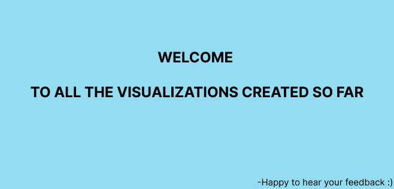

# Yashasvi's Portfolio

Making sense of facts/numbers using interesting visualization techniques!

# About me
I am a product manager with experience working in fintech and e-commerce. Currently pursuing grad school at Carnegie Mellon University.

# Fun Fact about me
I can cook 5 different cuisines

# What I am learning right now
Building habits

# Assignments
[Visualing government debt](https://yashasvm1.github.io/Portfolio/dataviz2)

[Assignment 3 & 4: Critique by Design](https://yashasvm1.github.io/Portfolio/critiquebydesign)

# Final Project

The topic of my final presentation is " Is it a good time to buy a house in California". These are the different steps involved in building project:

1) [Here](https://yashasvm1.github.io/Portfolio/finalproject) is the link to final project part 1

2) [Here](https://yashasvm1.github.io/Portfolio/finalproject2) is the link to final project part 2

3) [Here](https://yashasvm1.github.io/Portfolio/finalproject3) is the link to final project part 3
