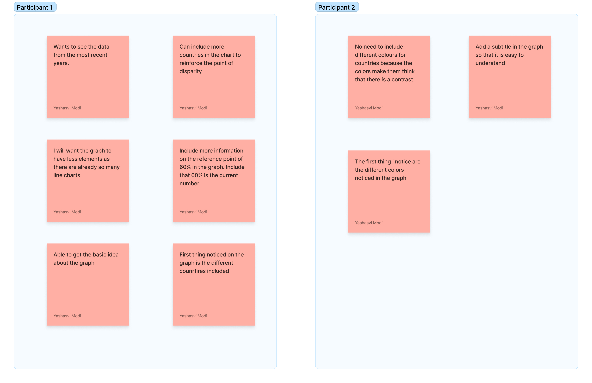

# Critique By Design 
For the purpose of this project, I worked on a data set from world back data to understand how the % of individuals with the internet has changed over time. As a product manager, I am fascinated with how technology affects everyone and internet accessibility was an interesting area to look at. Especially I also wanted to study how different countries are performing when it comes to accessibility to the internet. 

Link to the chart and source: https://data.worldbank.org/indicator/IT.NET.USER.ZS?end=2020&locations=1W&start=1990&view=chart

We are going to redesign this chart and these are the steps involved in the redesign: 

1. Critiquing the existing chart 
2. Creating wireframes of the redesign chart 
3. Conducting customer interviews to get feedback on the wireframes
4. Condensing the insights from user research 
5. Creating a solution 

# Chart to redesign

The chart below is from the world bank data. 

<iframe src="https://data.worldbank.org/share/widget?end=2020&indicators=IT.NET.USER.ZS&locations=1W&start=1990&view=chart" width='450' height='300' frameBorder='0' scrolling="no" ></iframe>

# Step 1: Critiquing the existing chart 

What stood out to you? 
The first thing when I look at this graph is the title. What stood out to me in the graph is that is a clear, focused graph and is not very confusing to look at. It tells about how the number of internet users has changed over time all over the world but misses to highlight a key takeaway. The chart looks too empty and can accommodate more data points. The chart has a lot of unused white space. 

What did you find worked really well?  What didn't?  
I think the simplicity of the graph worked well in this case but I think they should have provided more data points to make the chart interesting. The units in the graph are not very clear in this case. It is difficult to understand that they are talking about the y-axis having a percentage as a unit. A title like the number of internet users increasing over time can be a good title for this graph. Additionally, the aesthetics of the chart are not engaging as they have just used two colors in the whole graph and there are fewer talking points in the graph. 

What, if anything, would you do differently?  
If I had to rework the graph, I will: 
Mention the units on the axes to make sure that the viewer understands that the y-axis is the percentage of people who are internet users. A better data point to include here might be the total number of the world population that has access to the internet 
Usefulness: Have a few key takeaways from the graph for the user. A few things that can be included is how are the top-performing countries are doing as compared to the rest of the world 
Make the chart more engaging by including more colors and talking about some interesting insights about the chart so that the reader is interested to learn more about the topic 

# Step 2: Creating wireframes

I want to deliver a useful message from the visualization. To do that I have narrowed the scope of this graph and focused on the top-performing countries in terms of internet accessibility.  I have filtered the top 10 countries with the highest internet accessibility and want to highlight when these countries achieved 60% of the population with internet access (the world’s current population with internet access). I created two rough sketches to understnad how users react to these graphs and the main message that I want to deliver is that these countries achieved the current world's population 
with internet way before 2020 and the disparity in the development of internet accessibility everywhere else.

# Step 3&4: Customer Interviews and Condensation
For this exercise, I interviewed 2  students from academia to understand how they perceive these wireframes and get their feedback on the chart. Given below are the questions I asked them. 

Here is the feedback recevied and insights from the interviews

# Step 5: Redesign the chart 

From the feedback received from the past interviews I made the following changes in the chart: 

1. Added more description on the title
2. Included the graph till only the time when the internet popluation is 60% so that the users are able to focus more on that these countries were able to achieve this number way before 
3. Used a single color for all the countries to avoid any confusion 
4. I also wanted to add a World Chart to show the comparsion 

