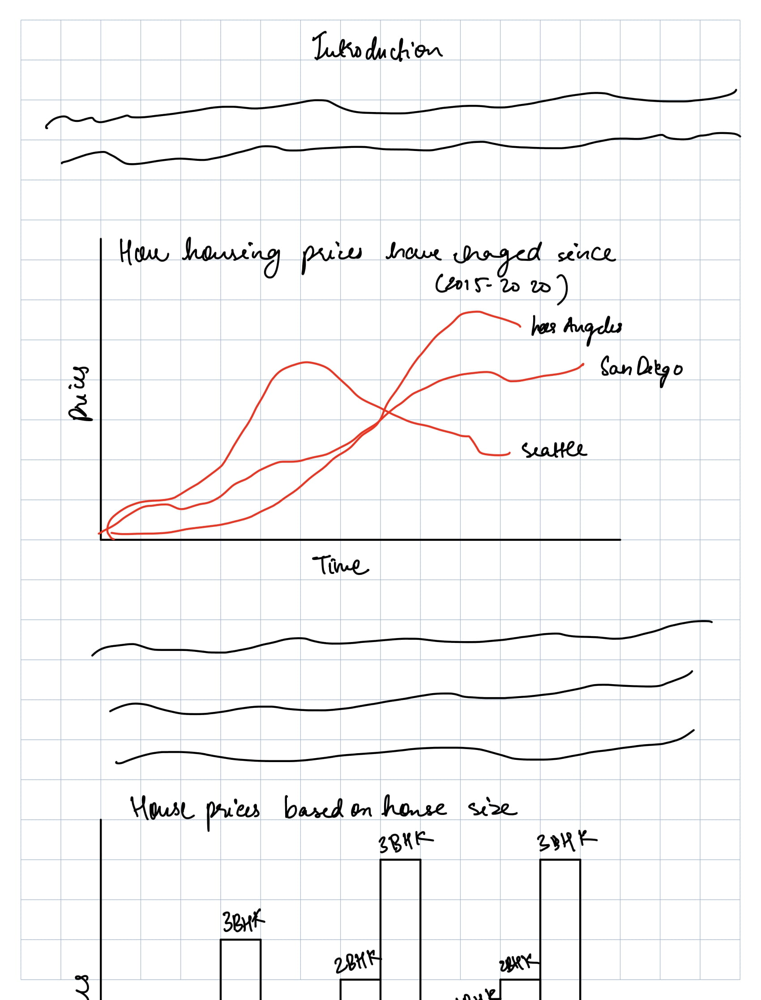
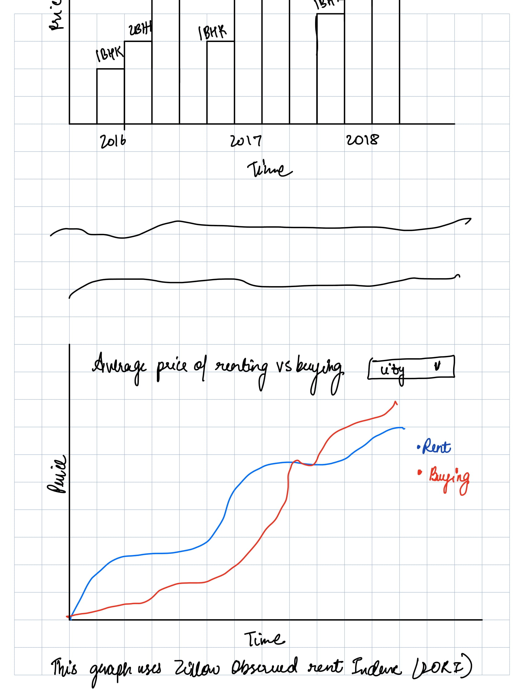
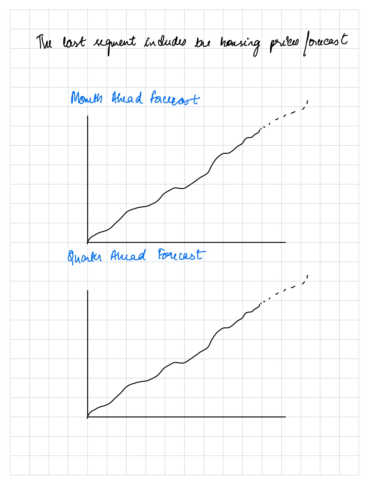

# Outline 

In this project, I have decided to work on how housing prices have changed over time on the west coast and other related data analyses. We will be focussing on Los Angeles, San Diego, San Jose, San Francisco, Portland, and Seattle in the analysis. As someone who is going to graduate soon and will hopefully start working in a few months. The next big move will be investing in a home, buying a car, and so on. This analysis will help in gaining insights to make those decisions and understanding how buying a home compare to renting out on the west coast. 

The three things I want to achieve from this project are: 

1) Show how house prices have changed over time 
2) Comparing prices of different house sizes (1bhk, 2bhk, 3bhk, etc)
3) How do renting and purchasing a house compare 

This analysis will give viewers will educate viewers on how the housing market changes over time and also how price changes from house size to house size. For this analysis, I am using grid line charts, bar charts, and line graphs.

# Initial Sketches

The below image includes the topics and how I am going to present those in my final project. I will refine it over the coming weeks. These are just my initial thoughts. 

# Data

The data is taken from: [# Outline 

In this project, I have decided to work on how housing prices have changed over time on the west coast and other related data analyses. We will be focussing on Los Angeles, San Diego, San Jose, San Francisco, Portland, and Seattle in the analysis. As someone who is going to graduate soon and will hopefully start working in a few months. The next big move will be investing in a home, buying a car, and so on. This analysis will help in gaining insights to make those decisions and understanding how buying a home compare to renting out on the west coast. 

The three things I want to achieve from this project are: 

Show how house prices have changed over time 
Comparing prices of different house sizes (1bhk, 2bhk, 3bhk, etc)
How do renting and purchasing a house compare 

This analysis will give viewers will educate viewers on how the housing market changes over time and also how price changes from house size to house size. For this analysis, I am using grid line charts, bar charts, and line graphs.

# Initial Sketches

The below image includes the topics and how I am going to present those in my final project. I will refine it over the coming weeks. These are just my initial thoughts. 

# Data

The data is taken from: [Zillow Data](https://www.zillow.com/research/data/). Here is the copy of the data in my drive: [Google Drive Copy](https://drive.google.com/file/d/1vHIxLUN5bZyENKc6GXy1MHXG0MA2gf-V/view?usp=sharing)

This data is from Zillow. Zillow is a tech real estate company and they have this data from the sales which have happened on their platform. I am going to export this data to Tableau or Flourish to create some visualizations. These visualizations will be only focussed on the west coast location and I will clean the data using excel and use the relevant data. The data is from as early as 2000. The data includes the adjusted home values in these regions. There is also data available on the forecasted value of these homes.

The format of the data is CSV which makes it easier to play around and clean. There is also data on how the home values are different on the housing type (1bh,2bh,3bh,4bhk). This data will help in contrasting the house values on the basis of housing type and how they change over time. Whether the change in the price of a 2BHK over time is less or more than the change in the price of a 3BHK, etc. 

# Medium and Method

Medium: For the presentation, I am going to use shorthand and for sketches, and user testing I am going to use iPad sketches, miro, and Figma. 

Method: For analysis, I am going to use flourish or tableau whichever is easier to use and relevant for the analysis. 
](url). Here is the copy of the data in my drive: https://drive.google.com/file/d/1vHIxLUN5bZyENKc6GXy1MHXG0MA2gf-V/view?usp=sharing

This data is from Zillow. Zillow is a tech real estate company and they have this data from the sales which have happened on their platform. I am going to export this data to Tableau or Flourish to create some visualizations. These visualizations will be only focussed on the west coast location and I will clean the data using excel and use the relevant data. The data is from as early as 2000. The data includes the adjusted home values in these regions. There is also data available on the forecasted value of these homes.

The format of the data is CSV which makes it easier to play around and clean. There is also data on how the home values are different on the housing type (1bh,2bh,3bh,4bhk). This data will help in contrasting the house values on the basis of housing type and how they change over time. Whether the change in the price of a 2BHK over time is less or more than the change in the price of a 3BHK, etc. 

# Medium and Method

Medium: For the presentation, I am going to use shorthand and for sketches, and user testing I am going to use iPad sketches, miro, and Figma. 

Method: For analysis, I am going to use flourish or tableau whichever is easier to use and relevant for the analysis. 

