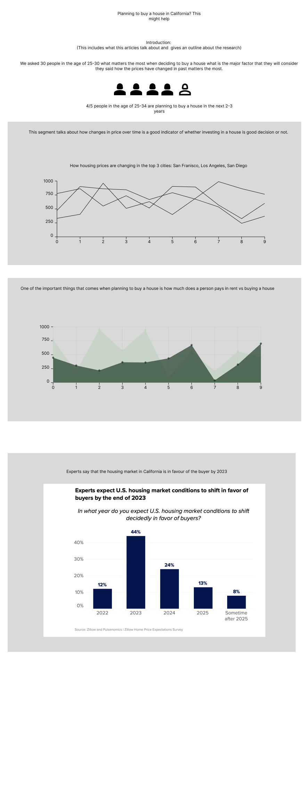

# Final Project Part II

The goal of this step is to understand the audience of the story and ensure you are communicating at an appropriate level, 
and telling the story using data visualization methods that are meaningful. There are four major partts of this document: 

1) Wireframes and Storybords
2) User Research Protocols 
3) Insights 
4) Summary

## Wireframes and Storboards

## User Research Protocol

### Research Session Goals

Our goal is to better understand:
What are the key takeaways for the users after seeing the wireframes?
Some of the observations on how to make the data visualizations more intuitive for the viewers 

### Core Questions

What stood out to you after seeing this story?
What thing did you find confusing in the story?
How did the visualizations help them to understand the housing market?
What are a few other things that you will like to see in the story?
 

### Participants & Recruitment Process
 
Participants will be recruited via social media on a voluntary basis. The criteria for target audience is people who have considered or have bought a house in the past.
 
### General Plan and Interview Questions
 
Introduction

10 mins: Introduction, focus, consent

Hello! Thank you for your time and help with this project. My name is    Yashasvi Modi     and I am one of the students in a  data visualization course this semester. I will be asking you some questions about a project I am working on and if I see other interesting things as we are discussing, I may ask more questions if that is ok with you.
(Mention confidentiality + recording)

You can stop your participation at any point during the interview. We would like to ask for your permission to video and audio record our interview and conversation. All the data and recorded information will be confidential and anonymous. We will use this data within the class only and for project purposes in the course only. We are not evaluating you or your work, this interview is for the purpose of learning more about travel planning. Is it ok for us to record?
 
Consent Script
Hi, thank you for the time and help with the project.  Your name will be kept confidential. 
We will conduct an interview that is roughly around 25-30 minutes in person. We will be emailing/messaging you the link prior to the scheduled interview time. During the interview, occasionally we will be asking probing questions like: why did you do that? Or how does that feel? You can always decline to answer any questions. We ask permission to record the video and audio of the interview. Is this okay?

### Interview Questions
 
Story
1.What do you think about the title of the story? Is it something you are interested in?
2.How do you feel about the topics covered in this story?
3.Are there topics that interested you more?
4.Are there topics that didn’t interest you?
5.What are the takeaways you have after reading the article?
6.Things which you didn’t like in the article?

Visualizations
1.How do you feel about the title?
2.What is the first thing that you notice about the visualization?
3.Is there anything confusing in the chart?
4.How do you feel about the aesthetics of the chart?

## Research Findings and Insights

## Summary and Next Steps
